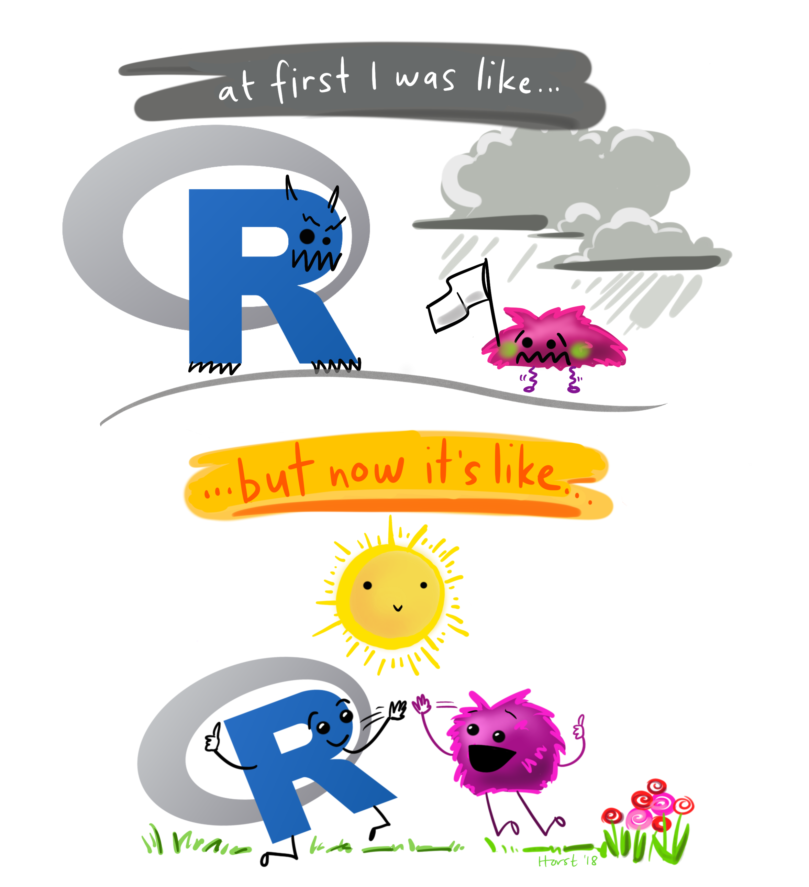
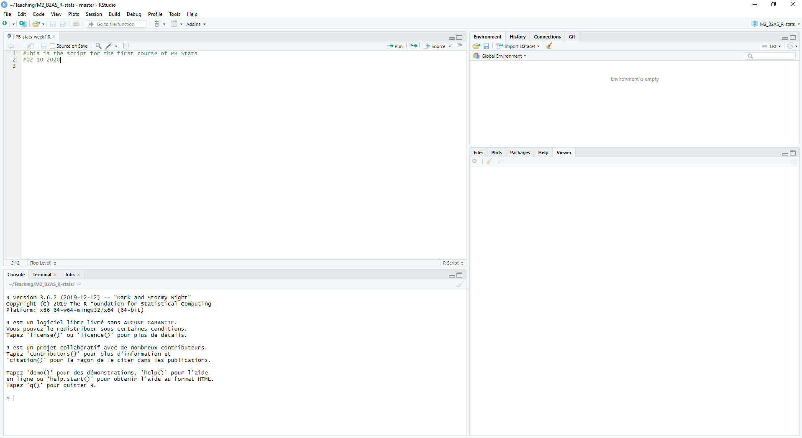
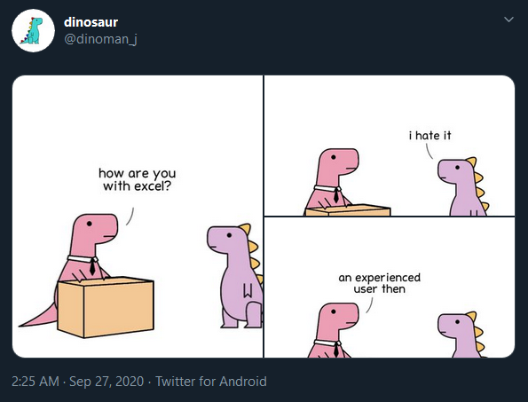

```{r, include = F}
# this is the session info, it gives information on which packages and which versions were used when creating these slides
# do not run these lines, as they are the output of the function sessionInfo()

# sessionInfo()
# R version 4.1.0 (2021-05-18)
# Platform: x86_64-w64-mingw32/x64 (64-bit)
# Running under: Windows 10 x64 (build 19043)
# 
# Matrix products: default
# 
# locale:
# [1] LC_COLLATE=French_France.1252  LC_CTYPE=French_France.1252    LC_MONETARY=French_France.1252
# [4] LC_NUMERIC=C                   LC_TIME=French_France.1252    
# 
# attached base packages:
# [1] stats     graphics  grDevices utils     datasets  methods   base     
# 
# other attached packages:
# [1] dplyr_1.0.6
# 
# loaded via a namespace (and not attached):
#  [1] Rcpp_1.0.7       pillar_1.6.1     bslib_0.3.1      compiler_4.1.0   later_1.2.0      jquerylib_0.1.4 
#  [7] highr_0.9        tools_4.1.0      digest_0.6.27    jsonlite_1.7.2   evaluate_0.14    lifecycle_1.0.0 
# [13] tibble_3.1.2     pkgconfig_2.0.3  rlang_0.4.11     cli_2.5.0        rstudioapi_0.13  yaml_2.2.1      
# [19] xfun_0.23        fastmap_1.1.0    stringr_1.4.0    knitr_1.33       generics_0.1.0   vctrs_0.3.8     
# [25] sass_0.4.0       tidyselect_1.1.1 glue_1.4.2       R6_2.5.0         fansi_0.4.2      rmarkdown_2.11  
# [31] xaringan_0.22    purrr_0.3.4      magrittr_2.0.1   servr_0.23       promises_1.2.0.1 htmltools_0.5.2 
# [37] ellipsis_0.3.2   mime_0.10        httpuv_1.6.3     utf8_1.2.1       stringi_1.6.1    crayon_1.4.1

```


layout: true
background-image: url(images/logos_new.png)
background-position: 50% 100%
background-size: 30%

---

## Who am I?
- Final year PhD student at INRAE, finishing a double degree program between the Université de Bordeaux and Université Laval in Québec

- Studying the effect of tree diversity and water availability on nutrient cycling in forests

- R enthusiast, coder


```{r cycle, echo = FALSE, out.width = '30%',fig.align = "center"}

```


---

## 

```{r intro pic, echo=FALSE, fig.cap="", out.width = '60%',fig.align = "center"}

```
<center> @allison_horst </center>

---
## R Course Objectives

- Understand the basis of the R language to be able to write your own scripts

--

- Optimize your dataset table (week 1)

--

- Choose a statistical model according to your scientific question (weeks 2 & 3)

--

- Create reproducible graphics (week 4)

--

- Know how to search for resources related to your question or code problem in R

---

## How this course works

- This is an interactive course, which means you will be coding throughout the course

- When you see this symbol, you use code to answer a question that I've stated:

```{r, echo=FALSE, fig.cap="", out.width = '30%',fig.align = "left"}

```

- Don't hesitate to ask questions  

- There will be a final project to be done in groups of 2, with a presentation on November 29th (more details will be given at the end of this course). 

---

layout: false

class: center, middle

## R basics

---

layout: true
background-image: url(images/logos_new.png)
background-position: 50% 100%
background-size: 30%

---

## The multiple facets of R 

R is a programming language, and RStudio is a graphical interface to help users with R  

R is open source, which means there are plenty of great solutions to issues that can be found online 

--

```{r why r pic, echo=FALSE, fig.cap="", out.width = '80%',fig.align = "center"}
knitr::include_graphics("images/week1/the_why_r_plot.png")
```
<center> @CSBQ </center>


---
## Let's get started

Open Rstudio, click on:  

<center> File → New File → R Script </center>

Save the R Script with an easy-to-find name

<br> 

--

## Good Practices

- Comment your code by using the # symbol 
- Write in your script, and then click **run** to evaluate the code in the console 

<center> Tip: You can also press "Ctrl" and "Enter" to run your code </center> 

---

## Explore R Studio

```{r rstudio, echo=FALSE, fig.cap="", out.width = '100%',fig.align = "center"}

```

Tip: you can change the colors of RStudio in 

<center> Tools → Global Options → Appearance </center>

---

## R as a calculator

```{r, echo=FALSE, fig.cap="", out.width = '30%',fig.align = "left"}

```
Type the following in your script and execute your code:

<center> 5*9-2+4 </center>

--

```{r calculator, echo = TRUE }
5*9-2+4

```

--
What does the [1] mean ?

Hint: type `1:100` into your script

--

```{r intro to index}
1:100
```

The [1] is a way to **index** the output = to locate the place in the string of numbers
---

## Objects in R 

- You can save values as objects 

```{r objects}
var1 <- 5*9
var2 <- 2+3
```

- Objects are stored in your Global Environment "Values"

--

<br>
```{r, echo=FALSE, fig.cap="", out.width = '30%',fig.align = "left"}

```
Create a new variable which is the multiplication of var1 and var2

--

```{r objects2}
var3 <- var1*var2
```

- What is the value of var3?

--

```{r objects3}
var3
```

---

## Tips for naming objects

- The first character should be a letter, i.e. var1 and not 1var


--

- The names should only include the following: letters, numbers, _ and . 

--

- Avoid using accents in your code, as it will may have troubles encripting (which is why I recommend to code in English)

--

- Don't use special keywords as names of your object (i.e. break, function, if,  etc. ). They will highlight when you type it in R

--

- Choose names which add meaning to your code (because it is likely that in 3 months you will have to decipher your code) 

---

## Functions 

A function is an argument with an input and an output

The arguments (what goes into the parentheses `()`) are objects (i.e. var1, var2, data frames, etc.)
--

Example: the `sum()` function
```{r}
var4 <- sum(var1,var2,var3)
var4
```

We use functions a LOT. Functions have arguments that need a certain order (to be detailled later)

---

## Data structures in R

```{r data structure pic, echo=FALSE, fig.cap="", out.width = '80%',fig.align = "center"}
knitr::include_graphics("images/week1/data_structure.png")
```

---

## Let's create a data frame from scratch

```{r, echo=FALSE, fig.cap="", out.width = '30%',fig.align = "left"}

```
Step 1: Create vectors 

```{r vectors}
#Character vectors
plant_sp <- c("tomato", "tomato", "tomato", "tomato")

treatment <- c("stress", "stress", "control", "control")
```

--

```{r vectors 2}
#Numerical vector
diameter <- c(2.3, 3.4, 4.3, 4.8)
```

--

Step 2 : Combine the vectors with the `data.frame()` function

```{r dataframe}

plant_data <- data.frame(plant_sp, treatment, diameter)
plant_data
```


---

## Indexing 

<center> data_frame_name[row, column] </center>

Example: 

`plant_data[1, ]` → Extracts the first row

*Note: empty index selects all the values*

`plant_data[ ,3]` → Extracts the third column


-- 


```{r, echo=FALSE, fig.cap="", out.width = '30%',fig.align = "left"}

```

Extract the second value from the third column

---

## Solution

```{r}
plant_data[2,3]
```


---

## Indexing 

You can use this to easily remove columns or rows from your data frame. 

Examples: 

```{r}
#remove column 1
plant_data_reduced1 <- plant_data[ , -1]
plant_data_reduced1
```

--

```{r}
#keep only row 3 and 4
plant_data_reduced2 <- plant_data[c(3,4), ]
plant_data_reduced2
```

---

## Your turn

```{r, echo=FALSE, fig.cap="", out.width = '30%',fig.align = "left"}

```


Create a new data frame with just rows 1 and 2, and columns 2 and 3 of the `plant_data` data frame 

---

## Solution (different ways to do this)

```{r}
#option 1
reduced_option1<- plant_data[c(1,2), c(2,3)]
reduced_option1

#option 2
reduced_option2<- plant_data[c(1,2), -1]
reduced_option2

#etc...

```


---

## Where to find help 

Online! 

- Stackoverflow

- Cross-validated 

- Google

**"R how to ..."** is my most frequent google search - and you almost always find an answer to your question. 

---

layout: false

class: center, middle

## Tidy data: using the `dplyr` package

```{r, echo=FALSE, fig.cap="", out.width = '30%',fig.align = "center"}
knitr::include_graphics("images/week1/dplyrsticker.png")
```

---

layout: true
background-image: url(images/logos_new.png)
background-position: 50% 100%
background-size: 30%

---

## How do we set up a data table? 

Example: You are setting up an experiment with four plants of corn, and you are measuring the height (cm) at five different time points (T1, T2, T3, T4, T5) .   

<br>
**On a piece of paper, write down a draft of your data table**
---

## "Intuitive" data table 

| Plant | Height_T1_cm | Height_T2_cm | Height_T3_cm | Height_T4_cm | Height_T5_cm | 
|---|---|---|---|---|---|
|CornA| 10 | 12 | 15| 25| 30|
|CornB | 9.5 | 11| ...| ...|... |
|CornC |  | | | | | 
|CornD |  | | | | | 


---

## More effective data table for R 

| Plant | Time | Height_cm | 
|---|---|---|
|CornA| T1 | 10|
|CornA| T2 | 12|
|CornA| T3 | 15|
|CornA| T4 | 25|
|CornA| T5 | 30|
|CornB| T1 | 9.5|
|CornB| T2 | 11
|...| ... | ...|


This is what we call 'tidy data'
---
## Introduction to 'tidy data'


```{r tidy pic, echo=FALSE, fig.cap="", out.width = '110%',fig.align = "center"}
knitr::include_graphics("images/week1/tidydata_1.jpg")
```
<center> @allison_horst </center>

---

## Why use 'tidy data'? 

- Most efficient way for R to read your data

- Easier for automation and iteration 

- Moving from Excel to R for all calculations : reproducible 

```{r tidy pic 2, echo=FALSE, fig.cap="", out.width = '80%',fig.align = "center"}
knitr::include_graphics("images/week1/tidydata_2.jpg")
```
<center> @allison_horst </center>

--

## Working directory

### In RStudio
We use the `setwd()` function so that R knows where to look for the data table. We can use `getwd()` to see in which directory we currently are.

```{r setwd}
getwd()
```

--


Tip: manually set your directory by clicking

<center> Session → Set Working Directory → Choose Directory </center>

Copy-paste the output from the R console into your script so that you only need to do it once. 

```{r}
setwd("C:/Users/tmaxwell/Documents/Teaching/M2_B2AS_R-stats")
```

---
## Loading the necessary package(s)

If you have not yet installed the package `dplyr`, you can do by clicking in the bottom right pannel: 

<center> Packages → Install, and typing the package name </center>

Or, you can run it in your script without the #
```{r}
# install.packages("dplyr")
```

--

You need to tell R where to look in its library for the packages you will use in your script.

```{r}
library(dplyr)
```

Tip: At the beginning of each script, only include the libraries which you will actually use. 

---

## Importing a data file

If data is under Excel file format, save as a .csv or a .txt file. 

We use the `read.table()` function. The "sep" (separator) will likely be different whether you are importing a .csv or a .txt file.

```{r}
data_co2 <- read.table("CO2_data_fromR.txt", header = TRUE, sep = "\t")
```

- The dataset shows results of an experiment on the cold tolerance of grass. 
- Grass samples from two regions (Quebec and Mississippi) were grown in either a chilled or nonchilled environment
- Their CO<sub>2</sub> uptake rate was tested at different CO<sub>2</sub> concentrations.

---


## Exploring the data

Use the `str()` function to look at the structure of your data table. 

What do you see? 

```{r}
str(data_co2)
```

--

There are four main data type: 
- `int` = integer (whole numbers) 
- `num` = numeric
- `chr` = character, alphabetical characters
- `Factor` = for both alphabetical and numerical characters, **can be placed in a certain order** 

---

## Selecting a column 

The `$` symbol selects a column. But there are other ways to do this: 

`data_co2$ID` ,

`data_co2[ , "ID" ]`,  

`data_co2[ , 1]` (because ID is the first column) 

are **all the same** 

---

## Changing data types for a column

Let's say we want to make the ID number a **factor**, we can use the `as.factor()` function  
- Note: this often happens when numbers are used to identify different levels in a column, but don't represent the number value

--

```{r}
#testing the as.factor() function
data_co2$ID <- as.factor(data_co2$ID)
```
<br> 
Note: Similarly, you can make a factor as a numeric value with `as.numeric()`. 
---

## More useful functions

- the `table()` and `levels()` are useful for numeric and factor columns, respectively  

```{r}
table(data_co2$conc)

levels(data_co2$Treatment)
```

- The `table(data_co2$conc)` gives us the number of observations for each value of `conc` = concentration. 

- The `levels(data_co2$Treatment)` gives us all the levels in the `Treatment` column. 
---

## Data wrangling with `dplyr`

Let's say that you want to find the mean per group in your experiment. 

How would you do this previously? 

--

Because this data table is 'tidy', we can use `dplyr` for such data manipulations and calculations. 

**Important Concept** : "piping" with %>%

    New Data Table <- Data Table %>% 
                      function1  %>% 
                      function 2 
                      etc... 

This reads: "Make a new data table, where you take my data table, apply function 1 to it, and then apply function 2 to the new subset made by function 1 "

---
## Example: means per group 

```{r piping, warning = F, message = F}
data_co2_means<- data_co2 %>%
  group_by(Treatment) %>%
  summarise(mean = mean(uptake))

data_co2_means  
```
-  `group_by()` is the first function

- `summarise()` is the second function, applied to each Treatment. 

- `mean =` names the column in which the `mean(uptake)` is written  
--

```{r, echo=FALSE, fig.cap="", out.width = '30%',fig.align = "left"}

```
Make a new data table in which you calculate the mean of the CO2 uptake per plant Type (Quebec vs. Mississippi)  


---

## Solution

```{r}
data_co2_means_type<- data_co2 %>%
  group_by(Type) %>%
  summarise(mean = mean(uptake))

data_co2_means_type
```

---

#Challenge: means, se, n per group

```{r, echo=FALSE, fig.cap="", out.width = '30%',fig.align = "left"}

```
Make a new data table in which you calculate the number of variables per observation (n), mean, and standard error of uptake per plant Type (Quebec vs. Mississippi)  

Hint: use the `summarise_each()` and the `funs()` function: 

<center> summarise_each(funs(n = n(), mean = mean(.), se = sd(.)/sqrt(n())), "uptake") </center>

--

```{r}
data_co2_means_se<- data_co2 %>%
  group_by(Type) %>%
  summarise_each(funs(n = n(), mean = mean(.), se = sd(.)/sqrt(n())), "uptake")
data_co2_means_se  
```

---

## Terminology

`dplyr::` means we are using a function from the dplyr package 

x %>% f(y)is the same as f(x, y), 

     data_co2 %>% 
      group_by(Type)
    
    is equal to 
    
    dplyr::group_by(data_co2, Type)  
    


---

## Filtering a data table

```{r filter pic, echo=FALSE, fig.cap="", out.width = '100%',fig.align = "center"}
knitr::include_graphics("images/week1/dplyr_filter.jpg")
```
<center>@allison_horst</center>


---

## Your turn

```{r, echo=FALSE, fig.cap="", out.width = '30%',fig.align = "left"}

```

Using the previous tutorial, filter the data table for the nonchilled treatment in Quebec? 

Hint: 

      new_df <- dplyr:: filter(df, ...)  is the same as 
      new_df<- df %>%
        filter(...)
      
---

## Solution

```{r}
quebec_nonchilled<- data_co2 %>%
  filter(Type == "Quebec" & Treatment == "nonchilled")
head(quebec_nonchilled )
```

And what if we want to directly find the n, mean, and standard error?

--

```{r}
quebec_nonchilled_mean<- data_co2 %>%
  filter(Type == "Quebec" & Treatment == "nonchilled") %>%
  summarise_each(funs( n = n(), mean = mean(.), se = sd(.)/sqrt(n())), "uptake")
quebec_nonchilled_mean
```

---

## Logics in R 

|Character|| Character||
|---|---|---|---|
| < | Less than | > | Greater than |
| != | Not equal to | == | Equal to |
| is.na |Is NA | !is.na |Is not NA |
| <= |Less than or equal to | >= |Greater than or equal to
|%in% |Group membership | 
| &| and| I | or

This can be used within the functions (i.e. when using `filter()`)

---

## More examples


```{r, echo=FALSE, fig.cap="", out.width = '30%',fig.align = "left"}

```
Pick one or both questions, and use the appropriate function to answer them: 

1. What is the mean `uptake` for each treatment type, for concentration values greater than or equal to 350?

2. Add a new column to the data frame, which multiplies the `conc` by the `uptake`
Hint: use the `mutate()` function 

<br>

Google "Rstudio dplyr cheatsheet" to get the following pdf, which may help
https://rstudio.com/wp-content/uploads/2015/02/data-wrangling-cheatsheet.pdf 

---

## Answers

```{r, warning = F, message = F}
#question 1: mean uptake for each treatment type, 
#for concentration values greater than or equal to 350?
treat_above350 <- data_co2 %>%
  filter(conc >= 350) %>%
  group_by(Treatment) %>%
  summarise(mean = mean(uptake))
treat_above350

#question 2: add a new column to the data frame
#which multiplies the `conc` by the `uptake`
data_co2 <- data_co2 %>%
  mutate(mult = conc*uptake)
head(data_co2)
```

---

## So how does R compare to Excel? 

```{r dino pic, echo=FALSE, fig.cap="", out.width = '60%',fig.align = "center"}

```
<center> @dinosaur </center>

Manipulating data in R is reproducible and tracable, which means it is less prone to user errors.  

---

## Other useful information

- R for data science:
https://r4ds.had.co.nz/ 
(the other of this book made the tidyverse!)

- Making nice-looking tables from your data:
https://rfortherestofus.com/2019/11/how-to-make-beautiful-tables-in-r/ 

- R references: 
https://cran.r-project.org/doc/contrib/Baggott-refcard-v2.pdf 

- Solutions to common tasks and problems in analyzing data in R: http://www.cookbook-r.com/ 

- Other useful websites for using dplyr:
https://rpubs.com/bradleyboehmke/data_wrangling 
https://seananderson.ca/2014/09/13/dplyr-intro/ 

---
## Group project

-	In pairs (groups of 2), select 2 papers which use linear regressions, ANOVAs and/or mixed models in their statistical analyses (we will go through these in class)

- Send the papers to me by Friday, Nov. 12th (tania.maxwell@inrae.fr), I will choose 1 of those papers for you to prepare a critique 

-	On Monday, Nov. 29th, give a 12min presentation and answer 5-10min of questions (T. Maxwell)

---

## What to present 

- Summarize the research aims and objectives of the paper: are they clear? Does the introduction give a good overview of the subject? 

- Critique the methods and statistical analyses: are they sufficiently detailed? Are they appropriate for the research question? 

- Explain the nature of the data (fixed vs. random factors, replications, etc.)

- Are the statistical tests appropriate? Why or why not? 

- Are the results valid? 

-	How could you improve the paper? 


---
---

layout: false

class: center, middle

## Next week: choosing your statistical test
