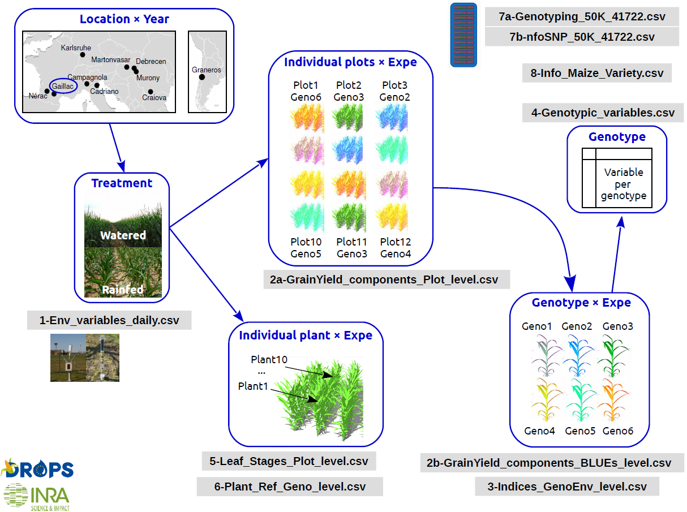

layout: true
background-image: url(images/logos_new.png)
background-position: 50% 100%
background-size: 30%

---

## Topics for today

- Explain the dataset we will be working with 

- Data format 

- Visual data

- Treatment effects 

- What to extract from your analysis 

---

### Dataset: A multi-site experiment in a network of European fields for assessing the maize yield response to environmental scenarios

```{r cycle, echo = FALSE, out.width = '60%',fig.align = "center"}

```


###### Citation: Millet, Emilie J.; Pommier, Cyril; Buy, Mélanie; Nagel, Axel; Kruijer, Willem; Welz-Bolduan, Therese; Lopez, Jeremy; Richard, Cécile; Racz, Ferenc; Tanzi, Franco; Spitkot, Tamas; Canè, Maria-Angela; Negro, Sandra S.; Coupel-Ledru, Aude; Nicolas, Stéphane D.; Palaffre, Carine; Bauland, Cyril; Praud, Sébastien; Ranc, Nicolas; Presterl, Thomas; Bedo, Zoltan; Tuberosa, Roberto; Usadel, Björn; Charcosset, Alain; van Eeuwijk, Fred A.; Draye, Xavier; Tardieu, François; Welcker, Claude, 2019, "A multi-site experiment in a network of European fields for assessing the maize yield response to environmental scenarios", https://doi.org/10.15454/IASSTN, Portail Data INRAE, V2, UNF:6:zF9w0A2f+MHeW7maeeXJWA== [fileUNF] 


---
## Experiment detail

A panel of 256 maize hybrids was grown:
- with two water regimes (irrigated or rainfed),
- in seven sites spread along a climatic transect from western to eastern Europe
- in 2012 and 2013

which equals 29 experiments,  as the combination of one year, one site and one water regime, with two and three repetitions for waterred and rainfed treatments, respectively. 

Measurements: 
- Hourly records of micrometeorological data and soil water status, and associated with precise measurement of phenology
- **Grain yield and its components at the end of the experiment** 


---
## Statistical Analysis

What is the **first** step to do when you start your statistical analysis? 

--

### <center> State the specific research question(s) </center>

Your statistical test should be based on the biological question.

--

Examples:

1. Is there a relation between the grain weight and the tassel height in the Gaillac site?

2. What is the effect of the water treatment and Variety ID on plant height in 2012? 


---

## Today's objectives 

- Go through the questions together, then individually

- Look into detail our analyses 

- Meanwhile, go through important concepts to keep in mind

---

## Data Import

```{r , message = FALSE, warning = F}
library(tidyr)
library(dplyr)
library(corrplot)
library(corrgram)
library(multcomp)
library(nlme)
library(lme4)

setwd("C:/Users/tmaxwell/Documents/Teaching/M2_B2AS_R-stats")
maize_data <- read.table("2a-GrainYield_components_Plot_level-1.csv", 
                         header = T, sep = ",") 
```

Note: Because we are importing a `.csv` file, the `sep = ` will be a comma. 

```{r, echo=FALSE, fig.cap="", out.width = '30%',fig.align = "left"}
knitr::include_graphics("images/week1/exercise_smaller.png")
```

What kind of data do we have here? 

Hint: Click on the data in your Global Environmentm, and use the `str()` function, 

---

```{r, eval = TRUE}
str(maize_data)
```
---

## Converting our data into the proper format 

You could write out each individual column in the following way:

`maize_data$year <- as.factor(maize_data$year)`

`maize_data$Replicate <- as.factor(maize_data$Replicate)`

etc...

--

OR you could use `mutate_if()` from the `dplyr` package. Here, the function states "If a column is a character, convert it as a factor" for the entire data frame. 

```{r}
maize_data <- maize_data %>% 
  mutate_if(is.character, as.factor) 

```

- It is important to this at the beginning to reduce future problems with analyses.

- Tip: try to name your columns in a consistent manner (i.e. all variables with capital first letter), because R is case-sensitive


---

## Exploring the data

```{r, echo=FALSE, fig.cap="", out.width = '30%',fig.align = "left"}
knitr::include_graphics("images/week1/exercise_smaller.png")
```

How many observations do we have per experiment? 

Hint: use the `table()` function

--

```{r}
table(maize_data$Experiment)
```

What do we see here? Does this make sense? Think of the experiment set up. 

---

layout: false

class: center, middle

## Question 1: Is there a relation between the grain weight and the tassel height in the Gaillac site? 

---

layout: true
background-image: url(images/logos_new.png)
background-position: 50% 100%
background-size: 30%

---

## Question 1: Is there a relation between the grain weight and the tassel height in the Gaillac site? 

Key parts to this question: 

- Relation between two **numerical** variables

- What are the units? 

`grain.weight`: individual grain weight (mg)

`tassel.height`: plant height including tassel, from ground level to the highest point of the tassel (cm)

Thus, they are both **continuous** variables

---

## Reminder

```{r continuous, echo = FALSE, out.width = '80%', fig.align = "center"}
knitr::include_graphics("images/week2/continuous_discrete.png")
```
<center> @allison_horst </center>


---

## Data Frame 


```{r, echo=FALSE, fig.cap="", out.width = '30%',fig.align = "left"}
knitr::include_graphics("images/week1/exercise_smaller.png")
```
First, separate the data frame to only include values from the Gaillac site. Hint: use piping `%>%` and the `filter()` function.

--

```{r}
maize_Gaillac <- maize_data %>%
  filter(Site == "Gaillac")
```

---

## Visualize the relation between grain weight and tassel height 
```{r, out.width = '60%', fig.align = "center"}
plot(maize_Gaillac$grain.weight ~ maize_Gaillac$tassel.height)
```

---

## Do the statistical test 

Which test do you think we should use? Why? 

--

### <center> Pearson's correlation </center>

Why? 
- Looking for the **relation** between two variables 
- There is not a clear cause and effect relationship between the variables (linear regression)
- There may be a third non-measured variable which acts on both the varibles in the correlation 

---

## Correlation vs linear regression

Correlation 

- used to associate two varibles (no cause and effect)
- mostly used as a "pre-analysis" phase to determine relations between explanatory variables (note: in different )

Linear regression

- often used for observational studies
- a cause and effect relationship is difficult to assure without having controled for other pertinente variables 
- be careful with interpretation

---
## What are the test assumptions for Pearson's correlation? 

1.  each variable should be continuous

2. related pairs: each value should have both a grain yield and a tassel height value

3. absence of outliers: can skew 

4. linearity: the shape of the dots is a line and not curved

Tip: you can find test assumptions online 

---

## Do we satisfy the test assumptions? 

[x] 1. Both variables are continuous

Related pairs? Let's remove the na values from the data frame using the `drop_na()` function

```{r}
maize_Gaillac <- maize_Gaillac %>%
  drop_na("grain.weight", "tassel.height")
```
[x] 2. NA values removed

---

Are there outliers which could skew the correlation? 

```{r, out.width = '50%', fig.align = "center"}
plot(maize_Gaillac$grain.weight ~ maize_Gaillac$tassel.height)
```

Visually, we can determine to remove the values at the bottom of the graph, with grain weights lower than 100mg. 

---

```{r, echo=FALSE, fig.cap="", out.width = '30%',fig.align = "left"}
knitr::include_graphics("images/week1/exercise_smaller.png")
```
Remove the values with a grain weigh lower than 100 mg to create a new data frame for the analyses. 

Hint: use the `filter()` function.

--

```{r}
maize_Gaillac_red <- maize_Gaillac %>%
  filter(grain.weight>100)
```

---
Check the number of observations in each data frame in your Global Environment. You can also check with a graph:

```{r, out.width = '40%', fig.align = "center"}
plot(maize_Gaillac_red$grain.weight ~ maize_Gaillac_red$tassel.height)
```

[x] 3. Outliers removed

[x] 4. Linearity (no curved shape within the dots)
---

## Pearson's correlation

Here the p-value corresponds to the statistical test with 

H<sub>0</sub> : r = 0 (there is no correlation)  H<sub>1</sub> : r <span>&#8800;</span> 0

--

```{r}
cor.test(maize_Gaillac_red$grain.weight, maize_Gaillac_red$tassel.height)
```

The Pearson's coreltation shows a significant positive (`cor` value is positive) relationship. 

---
**However,** a significant result is not very informative (with a large number of samples, anything can become significant)

It is better to look at the strength of the correlation (r<sup>2</sup>)

--

## Finding the r<sup>2</sup>

The r<sup>2</sup> is the r correlation value, squared

```{r}
cor(maize_Gaillac_red$grain.weight, maize_Gaillac_red$tassel.height)^2
```

We can conclude that **1.87%** of the variation of the grain weight is associated to the tassel height.
---

## Subsetting for a correlation matrix

We can get a quick overview of how all of our numeric columns value  relate to one another 

First, we need to subset only the numeric columns. One way we can do this is by viewing our data table and noting the numeric columns.
```{r}
maize_Gaillac_num <- maize_Gaillac[,c(13:21)]
```

Or, we could select columns which are numeric using `select(where(is.numeric))` 

```{r}
maize_Gaillac_num <- maize_Gaillac %>% 
  dplyr::select(where((is.numeric)))
```
Note: the `select()` function is present in several packages, so by using `dplyr::` we are telling R in which package to take the function.   


--


We need to remove NA values from the data frame. Do do so, we can use the `na.omit()` function. 
```{r}
maize_Gaillac_num <- na.omit(maize_Gaillac_num)
```

---

We will use a function which needs a correlation matrix from our values. To do so, we will use the `corrgram()` function.
```{r}
corr_maize <- corrgram(maize_Gaillac_num)
```

---

## Correlation matrix

Positive correlations are displayed in blue and negative correlations in red color. Color intensity and the size of the circle are proportional to the correlation coefficients. 

```{r, out.width = '50%'}
corrplot(corr_maize, method = "circle", type = "upper", tl.col= "black")
```


---
## Your turn
```{r, echo=FALSE, fig.cap="", out.width = '30%',fig.align = "left"}
knitr::include_graphics("images/week1/exercise_smaller.png")
```

Using the previous data table, what is the relation between grain weight and tassel height within the waterred site? And within the rainfed site? 

---
## Solution

```{r}
maize_Gaillac_wat <- maize_Gaillac_red %>%
  filter(treatment == "watered")

cor(maize_Gaillac_wat$grain.weight, maize_Gaillac_wat$tassel.height)^2
```

We can conclude that **7.49%** of the variation of the grain weight is associated to the tassel height if we only include the watered sites.
--

```{r}
maize_Gaillac_rain <- maize_Gaillac_red %>%
  filter(treatment == "rainfed")

cor(maize_Gaillac_rain$grain.weight, maize_Gaillac_rain$tassel.height)^2
```

We can conclude that **4.36%** of the variation of the grain weight is associated to the tassel height if we only include the rainfed sites.

Does this make sense? 

---

layout: false

class: center, middle

## Question 2: What is the effect of the water treatment and Variety ID on plant height in 2012? 

---

layout: true
background-image: url(images/logos_new.png)
background-position: 50% 100%
background-size: 30%

---

## Question 2: What is the effect of the water treatment on plant height in 2012? 

Key parts to this question: 

- Effect of **two factors** (treatment and Variety) on a **numerical** variable (plant height)

- `plant.height` : from ground level to the base of the flag leaf (highest) leaf (cm), continuous variable 


Which test should we use? Why? 
<br>

---

## ANOVA (Analysis of Variance)

- Variance can be used to test whether means of treatments differed: as the means become more different, the variances increase 

```{r, echo=FALSE, fig.cap="", out.width = '80%',fig.align = "center"}
knitr::include_graphics("images/week2/variance.png")
```

---

#ANOVA reminder:  `x ~ a+b+a:b` 

|`aov()`|`anova(lm())`|
|---|---|
| Analysis of Variance | Analysis of variance of a linear model|
| Type 1 Sum of Squares: | Type 3 Sum of Squares: |
| *SS(A) for factor A* | *SS(A / B, AB) for factor A* |
| *SS(B / A) for factor B* | *SS(B / A, AB) for factor B* |
| *SS(AB / B, A) for interaction AB* | 
| Will give different results if unbalanced data depending which factor is written first | Allows for unbalanced data. |

--

    mod_aov <- aov(x ~ a + b + a:b)
    mod_aov output is directly the Analysis of Variance Table
    
    mod_lm <- lm(x ~ a + b + a:b)
    anova(mod_lm) gives the Analysis of Variance Table 

---

#Example 

We will decipher the Analysis of Variance table in detail with the example.

Note: an anova is basically an extended t-test (which compares the variance of two groups)

---

## Reducing the `maize_data` dataframe 

```{r, echo=FALSE, fig.cap="", out.width = '30%',fig.align = "left"}
knitr::include_graphics("images/week1/exercise_smaller.png")
```
Separate the data frame. 

- Only the year 2012

- To simplify our question, we will focus on three Varieties: 
`"HMV5422","11430" and "F712"`

  Hint: use the `|` symbol to include several values for `Variety_ID`

- Remove the NA values from the `"plant.height"` column

---

## Answer

```{r}
maize_2012 <- maize_data %>%
  filter(year == "2012") %>%
  filter(Variety_ID == "HMV5422" | Variety_ID == "11430" | Variety_ID == "F712")%>%
  drop_na("plant.height") %>%
  droplevels() #we need to add this to remove the other levels of Variety 
str(maize_2012)
```
---

## Looking at data visually

```{r, fig.width=18,fig.height=8}
boxplot(plant.height ~ treatment*Variety_ID, data = maize_2012)
```

What can we see?

--

-There seems to be a positive effect of watering plants on plant height (makes sense). We don't see a clear treatment effect, but there might be. 

---
## Testing models

Can we use `aov()`? Hint: use the table() function for our factors to see if we have a balanced dataset for our different factors in our dataset.  

--
```{r}
table(maize_2012$Variety_ID)

table(maize_2012$treatment)
```

Because we have unbalanced data, it is better to use the `lm()` function. 
---

## Using the `lm()` function


```{r}
mod_lm <- lm(plant.height ~ treatment + Variety_ID, data = maize_2012)
anova(mod_lm)
```


---
## What are the test assumptions

Before analyzing the data, check the following assumptions: 

1. Homogeneity (or homoscedasticity) of variances (look at residuals vs fitted)

2. Normality of residues (but normality isn't as important as homoscedasticity for an ANOVA)

3. No outliers

4. The plant.height data are randomnly selected and are independent (will go over this later) 
---

## Check the assumptions

```{r ,out.width = '60%', fig.align = "center" }
par(mfrow = c(2, 2))
plot(mod_lm)
```

---
## Looking at the analysis of variance table

```{r}
anova(mod_lm)
```


| Source | SS | df | MS | F |  
|---|---|---|---|---|
|Effect A| given | a-1 | SS/df | MS(A) / MS(W)| 
|Effect B| given | b-1 | SS/df | MS(B) / MS(W)| 
|Within (residuals)| given |  | SS/df | | 

---

## Let's break down the table output

```{r}
anova(mod_lm)
```


Df: degrees of freedom =  the number of values in the final calculation of a statistic that are free to vary 

- Each main effect has k-1 Df 

ex:  `Variety_ID` has 3 levels (k=3) so df = 3-1 = 2

and `treatment` has two levels (m=2) so df = 2-1 = 1


---

```{r}
anova(mod_lm)
```

- The residuals df is the total number of observations (N) - 1 - the df of each effect (k-1) and (m-1). 
- You can find N by calculating the `length` of `plant.height` in the maize_2012 data table, or by looking in the Global Environment data values

--

```{r}
length(maize_2012$plant.height)
```

= N - 1 - (k-1) - (m-1) = 103 - 1 - 2 - 1 = 99

Why is this important? You can use this to better understand tables published in papers. You can also easily see if authors have removed data points from their analysis (the N.)

---

## Fisher's test

<center>Sum of Squares of group / Sum of squares residuals (within) </center>


Ex: If the `Variety_ID` means of plant height are more different (vary more between the different levels) than the plant height vary within the different Variety levels, the F-test ratio would be greater than an F-value expected by chance.

```{r, echo=FALSE, fig.cap="", out.width = '60%',fig.align = "center"}
knitr::include_graphics("images/week2/variance.png")
```

---

## The p-value

```{r}
anova(mod_lm)
```

R then compares the F ratio calculated to the expected value given the two degrees of freedom (between the groups and within the groups), with alpha set to 0.05%.

If the p-value is less than the chosen significance level, the data provide sufficient evidence to conclude that your model fits the data better than a model with no independent variables.

Be cautious with interpreting p-values (will go over next week)

---
## `Summary()`

```{r}
summary(mod_lm)
```


---
## Post-hoc tests

The F-test doesn’t reveal which Variety_ID means are different, only that the Variety_ID means are different. 

Therefore, we can do a multiple comparison test, also called a posthoc test 

--
```{r}
modposthoc = lm(plant.height ~ Variety_ID+treatment, 
                data = maize_2012, na.action=na.omit)
tuk <- glht(modposthoc , linfct = mcp(Variety_ID= "Tukey"))
```
---

```{r}
summary(tuk) 
```

--

We can also use the `cld()` function to get the classic letter display. 
```{r}
tuk.cld <- cld(tuk)   # letter-based display
tuk.cld
```

---

## Your turn

In groups of 2: 

- State a research question for this data set (a response variable, and then one or more )

- Divide the original data set by site, year, treatment and/or variety 

- Choose the (or several) fixed effect factors and the response variable according to your research question

- Write your model, test the assumptions and state your results

- Calculate the n, mean, and standard error for your groups 


---

## Next week 

- Pseudoreplication

- Heritability

- Multivariate analyses

- Rmarkdown basics


---

## References

Schumaker & Tomek 2013. Understanding Statistics Using R. *Springer*

http://www.sthda.com/english/wiki/visualize-correlation-matrix-using-correlogram 

https://howecoresearch.blogspot.com/2019/01/using-analysis-of-variance-anova-in.html 

Ressources: 

https://www.youtube.com/watch?v=-yQb_ZJnFXw 