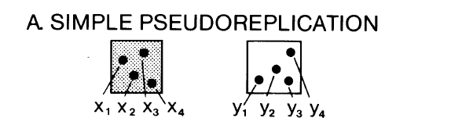
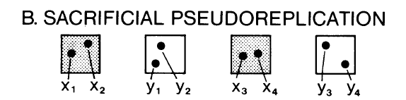
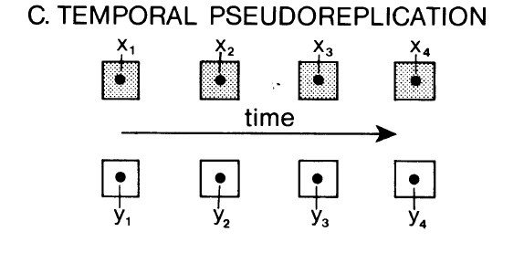
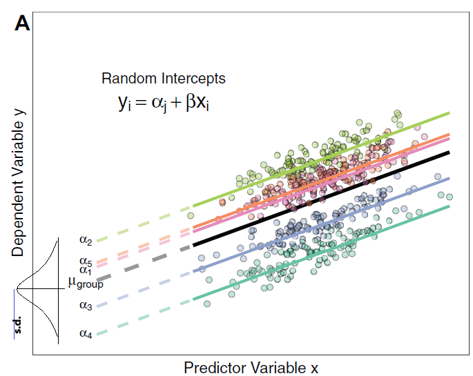
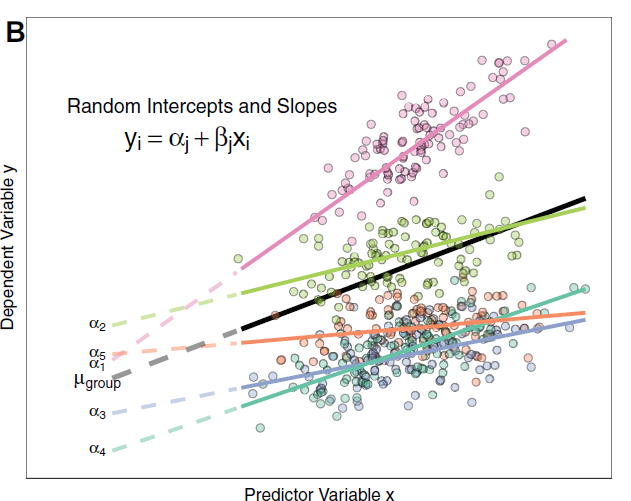
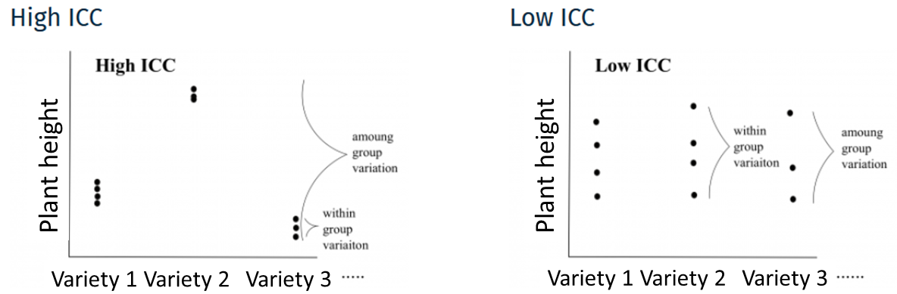
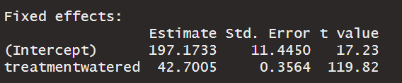
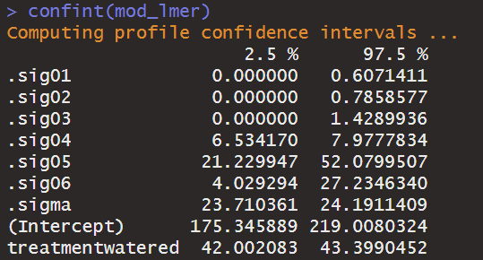
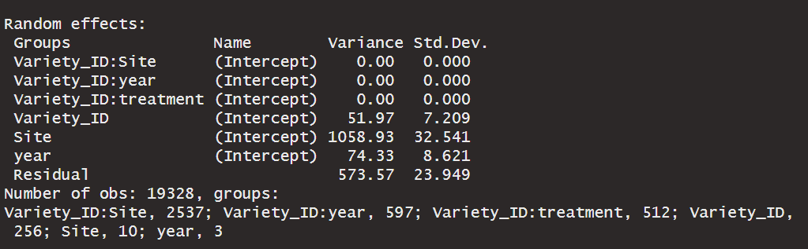

layout: true
background-image: url(images/logos_new.png)
background-position: 50% 100%
background-size: 30%

---
## Topics for today

- Fixed vs. random effects

- Pseudoreplication

- Linear mixed effect models (LMMs)

- Heritability

- Rmarkdown basics

---

### Dataset: A multi-site experiment in a network of European fields for assessing the maize yield response to environmental scenarios

Run the script I sent
```{r, message = FALSE}
library(tidyr)
library(dplyr)
library(multcomp)
library(lme4)

setwd("C:/Users/tmaxwell/Documents/Teaching/M2_B2AS_R-stats")
maize_data <- read.table("2a-GrainYield_components_Plot_level-1.csv", 
                         header = T, sep = ",") 

maize_data$year <- as.factor(maize_data$year)
maize_data$Replicate <- as.factor(maize_data$Replicate)
maize_data$block <- as.factor(maize_data$block)
maize_data$Row <- as.factor(maize_data$Row)
maize_data$Column <- as.factor(maize_data$Column)
maize_data$Code_ID <- as.factor(maize_data$Code_ID)
maize_data$Variety_ID <- as.factor(maize_data$Variety_ID)

```

---

## Research question: 

Previous question we answered: What is the effect of the water treatment and Variety ID `HMV5422`,`11430`, and `F712`, on plant height in 2012? 

We had found that the watered plant heights were significantly different to the the rainfed, and that Variety `HMV5422` produced significantly higher plant heights than Variety `11430` in 2012. 

--

Now, let's broaden the research question. What is the effect of the treatment on plant height in the entire experiment? 

How do we take into account the fact that the observations came from different sites? years? 

--

We can use a mixed-effect model using these variables as **random effects**. 

---
## Data structure

```{r}
str(maize_data)
```
---

## Let's remove NA values from the plant.height column

```{r, echo=FALSE, fig.cap="", out.width = '30%',fig.align = "left"}
knitr::include_graphics("images/week1/exercise_smaller.png")
```

Hint: use the piping %>% and the `drop_na()` function.
--

```{r}
maize_data <- maize_data %>%
  drop_na(plant.height)
  
```

---

## Fixed vs random effect

**Fixed effect**: when the researcher decides the treatments which will be tested 

- ex: effect of three specific varieties on plant variety, to know which variety will produce the tallest plants
- In most studies, the effects are fixed. 

--

**Random effect**: the researcher randomly selects treatments that will be studied, among all of the availabile treatments (this is when the researcher is interested in a general effect of the treatment on the response variable)

- ex: effect of the plant variety on plant height (here, the researcher randomly selects different varieties)
- Here, we are interested in the variability between different varieties, as opposed to specific differences between three Varieties 

---

## What's the difference then? 

The difference between fixed and random effects is in the interpretation.

- For a fixed effect, the conclusion is applicable to the treatments studied in the experiment (i.e. Varieties `HMV5422`, `11430` and `F712`)

- For a random effect, the conclusion is applicable to all of the Varieties 

<br> 

We also calculate the ANOVA table differently - the denominator used to calculate the F-ratio for the test differs if a factor is random or fixed 

---
## Random effects continued

Random effects can also be used to take into account your data structure and statistical independence. 

- For example, observations from the same site and the same year are more similar than from a different site or year. 

They allow us to take into account pseudoreplication to ensure statistical independence for our observations.

---

## Pseudoreplication

Important paper for experimental set-up: Hurlbert, S. H. (1984). Pseudoreplication and the design of ecological field experiments. Ecological monographs, 54(2), 187-211. 

Three main types of pseudoreplication: 

- simple

- sacrificial 

- temporal

---
## Simple pseudoreplication

```{r , echo=FALSE, fig.cap="", out.width = '50%',fig.align = "center"}

```
<center> Hurlbert et al. 1984, Ecological Monographs </center>

- When there are several observations but only 1 experimental unit per treatment (i.e. if there was only one site with watered vs rainfed, and we took several observations of plant height in each treatment)
- Here, the observations are not independent

--


Solution: 

- Increase the number of experimental units. This is usually done by having several 'blocks' of each watered and rainfed treatments (in this experiment, there were 2 watered and 3 rainfed experimental untis)

---
## Sacrificial pseudoreplication 

```{r , echo=FALSE, fig.cap="", out.width = '50%',fig.align = "center"}

```
<center> Hurlbert et al. 1984, Ecological Monographs </center>
- When there are several observations on an experimental unit, and/or 
- When you combine the data in one analysis without taking into acount their origin (i.e. combining data, justifying that "there were no difference between sites so we combined them in one analysis)

--

Solution
- Use a mean of the observations on one experimental unit in the model, or
- Use a model which takes into account the strucutre that there are observations within an experimental unit (i.e. using random effects)
---

## Temporal pseudoreplication
```{r , echo=FALSE, fig.cap="", out.width = '40%',fig.align = "center"}

```
- When you take several measurements on an experimental unit (i.e. measuring the plant height once a month), and that you consider these measurements to be independent 

--

Solution
- Analyse each the measurements from each month (or other time period) separately 
- Use a model which takes into account repeated measures (ANOVA for repeated measures, mixed models, etc. to take into account the autocorrelation between different measurements).

 We will not go over these, but there plenty of ressources online. 

---

## Linear Mixed Effect Models (LMM)

Mixed effect models include a large variety of different models which allows us to correctly take into account the data structure (niched data/ grouping factors, repeated measurements, etc.)

--

Let's go back to our question for this week: is there an effect of the treatment on plant height in our experiment (several sites, 2 years and 37 varieties)? 

Why use a linear mixed effects model (LMM)?

--

- Here, we are interested in the general effect

- The relationship may differ slightly among varieties due to unmeasured processes, or among experimental sites or year due to unmeasured environmental variables. We want to represent this data structure in our model. 

---

## Why choose a LMM?

LMM are a balance between separating the dataset (per site, year, etc) and lumping the data together (i.e. not accounting for differences between the)

- Estimate slope and intercept parameters for each site and year (separating) but estimate fewer parameters than a classical regression.

- Use all the data available (lumping) while accounting for pseudoreplication and controlling for differences among sites and years. 

---

## How do LMMs work? 

- Intercepts and/or slopes are allowed to vary according to a given factor (i.e. random effect factor), such as site or year

- Intercepts, slopes and their confidence interval are adjusted to take into account the data structure

---

## Random intercept

- It is assumed that the intercepts come from a normal distribution
- Only need to estimate the mean (µ) and standard deviation of the normal distribution instead of the n intercepts (i.e. one for each site)


```{r intercept pic, echo=FALSE, fig.cap="", out.width = '50%',fig.align = "center"}

```
<center> Harrison et al. 2018, PeerJ </center>

Note that the more levels your factor has, the more accurately the mean and standard deviation of the normal distribution will be estimated. 

---

## Random intercept

Thus, the model only needs to estimate the mean and standard distribution of the intercepts, instead of the 29 intercepts (for sites)

```{r , echo=FALSE, fig.cap="", out.width = '50%',fig.align = "center"}

```
<center> Harrison et al. 2018, PeerJ </center>

---

## Random slope

The same principle applies to slopes that vary according to a given factor (i.e. the random effect of site differs on the rainfed vs watered treatments) - only the mean and s.d. of the slopes are estimated. 

```{r , echo=FALSE, fig.cap="", out.width = '50%',fig.align = "center"}

```
<center> Harrison et al. 2018, PeerJ </center>

Here, both intercepts and slopes are permitted to vary by group. Random slope models give the model far more flexibility to fit the data, but require a lot more data to obtain accurate estimates of separate slopes for each group.

---
## Taking into account the data structure 

- If a certain site or year is poorly represented (not many values), the model will give more weight to the pooled model to estimate the intercept and slope of that site or year. 


```{r , echo=FALSE, fig.cap="", out.width = '50%',fig.align = "center"}
knitr::include_graphics("images/week3/fig_12_w5.png")
```
<center> @CSBQ </center>

---
## Taking into account the data structure 

The confidence intervals for the intercepts and slopes are adjusted to take account of the pseudo-replication-based on the **intraclass correlation coefficient (ICC)**

ICC: How much variation is there in each group versus between groups?

---

## Interclass correlation coefficient (ICC)

High ICC (low variation within group, and high variation among groups)
- points are treated as single observation because they are correlated
- small effective sample size
- **large confidence intervals** for slope and intercept 

```{r , echo=FALSE, fig.cap="", out.width = '80%',fig.align = "center"}

```
Low ICC
- points coming from the same Variety are treated independently because they are little correlated
- large effective sample size
- **small confidence intervals** for slope and intercept 

<center> @CSBQ </center>
---
## Data exploration

Look at the distribution of samples for each factor level using the `table()` function

```{r, echo=FALSE, fig.cap="", out.width = '30%',fig.align = "left"}
knitr::include_graphics("images/week1/exercise_smaller.png")
```

--

```{r}
table(maize_data$Site)
table(maize_data$year)
table(maize_data$treatment)
```

---
## Data exploration

**Mixed-effect models can be used to analyze unbalanced experimental plans**

--
```{r, echo=FALSE, fig.cap="", out.width = '30%',fig.align = "left"}
knitr::include_graphics("images/week1/exercise_smaller.png")
```

Look at the distribution of the continuous variables using the `hist()` function

--
```{r, out.width = '30%',fig.align = "center"}
hist(maize_data$plant.height)
```

Major deviations could cause heteroscedasticity problems. If necessary, make transformations. In this case, the data seems OK.

---

## Data exploration

Check for collinearity between your explanatory variables

Ex: If we wanted to test the effect of plant height and tassel height on grain weight. 

--

- The problem with collinear predictors is simply that they explain the same thing, so their effect on the response variable will be confounded in the model

- In this example, there is no risk of collinearity with no continuous variables. If you had another continuous variable (Var2), one simple way to check for collinearity is:

    cor(var1, var2)

In the above example, it would be better to just include plant **or** tassel height on grain weight
---
## Setting up the model 

Let's go back to our original question: what is the effect of treatment on the plant height? 

Which are our fixed effect factors? And our random factors? 

--

Fixed effects 
- `treatment`: this is something we controlled and specifically want to test

Random effects 
- `Variety_ID`: here, we are interested in the **general** trend of Variety, not in specific differences between the chosen varieties. 
- `Site` 
- `year`
- `Replicate` within the `treatment` / `year` / `Site`

Depending on the research question, random effects could be fixed effects


---

## How to write an LMM in R?

There are several packages which can be used. Today we will look at the `lmer()` (linear mixed model) function from the `lme4`package.

```{r, warning = FALSE}
mod_lmer <- lmer(plant.height ~ treatment + 
                   (1|Variety_ID) + (1|Site) + (1|year) +
                   (1|Variety_ID:Site) + 
                   (1|Variety_ID:year) + 
                   (1|Variety_ID:treatment), 
                 data = maize_data, REML = TRUE)
```

- `(1|Variety_ID)`: indicates varying intercept but keeping the same slope
- `:` : indicates an interaction effect  
- `REML = TRUE`: estimation method

Note: Here we have **not** added the random effect (1|treatment/year/Site/Replicate) because the model fails to converge (too many parameters to estimate).

---
## Note on estimation methods

REML (Restricted Maximum Likelihood) is the default method in lmer

Note that the standard deviation estimator in the Maximum Likelihood (ML) is biased by a factor of (n−2)/n. The REML method corrects this bias.

- We should compare nested random effect models with REML (such as `treatment/year/Site/Replicate`)

- While we should compare nested fixed effect models with ML

---

## What if we wanted the slope of a random effect to vary? 

Let's say that we think that the random effect of the site will be dependent on the water treatment (i.e. a site in southern Europe may influence plant.height differently when rainfed than a northern site which receives more rain).

```{r}
mod_lmer2 <- lmer(plant.height ~ treatment + 
                   (1|Variety_ID) + (treatment|Site) + 
                    (1|year) +
                    (1|Variety_ID:Site) + 
                    (1|Variety_ID:year) + 
                    (1|Variety_ID:treatment), 
                 data = maize_data, REML = TRUE)
```

We will continue with the previous model.

---
## A note on model selection

The choice of the factors which are included in the model depends on the research question.

However, to determine if you have built the best mixed model based on your prior knowledge, you should compare this *a priori* model to other alternative models

With the dataset we are working on, there are several alternative models that might better fit the data.

---

## Model selection 

We can see if our model compares to the basic linear model which does not include random factors. To do so, we need to change the estimate method to ML, so `REML = FALSE` because `lm()` doesn't use the same estimation method as `lmer()`. 

For example, we could compare the following models (we will skip this step):

```{r, eval = FALSE}
#Linear model with no random effects
M0 <- lm(plant.height ~ treatment, data = maize_data)

#Our model 
M1 <- lmer(plant.height ~ treatment + (1|Variety_ID) + 
             (1|Site) + (1|year) + (1|Variety_ID:Site) + 
             (1|Variety_ID:year) + (1|Variety_ID:treatment), 
           data = maize_data, REML = FALSE)

#Lmer model with Experiment and Replicate
M2 <- lmer(plant.height ~ treatment + (1 | Variety_ID) + 
             (1 | Experiment/Replicate), data = data, REML = FALSE)

#Lmer model with varying intercepts and slopes
M3 <- lmer(plant.height ~ treatment + (treatment | Variety_ID) + 
             (treatment | Experiment/Replicate), data = data, REML = FALSE)
```

---

## Model selection 

- Models can be compared by using the AICc function from `theAICcmodavg` package

- The Akaike Information Criterion (AIC) is a measure of model quality that can be used to compare models

- AICc corrects for bias created by small sample sizes

More information for model selection can be found here:  
https://qcbsrworkshops.github.io/workshop06/workshop06-en/workshop06-en.html#57 


-- 


**We will skip this process today, and continue with our original `mod_lmer` model.**
---
## Check the model assumptions

1. Homogeneity of variance (predicted values vs residual values plot)

2. Check independence of the model residuals 

3. Check normality of model residuals (but mixed-models are robust to deviations from normality)

---

## Homogeneity of variance 
```{r, out.width = '40%',fig.align = "center"}
plot(resid(mod_lmer) ~ fitted(mod_lmer), 
     xlab = 'Predicted values', ylab = 'Normalized residuals')
```

There seems to be a few outliers, but no large trends. We will keep all data points. 

However, if we wanted to remove some points we could use the function `identify(resid(mod_lmer)~ fitted(mod_lmer))` and click on the points, which gives us the row number of the individuals from the data table  

---
## Homogeneity of variance 


```{r , echo=FALSE, fig.cap="", out.width = '80%',fig.align = "center"}
knitr::include_graphics("images/week3/resid-plots.gif")
```
<center> @CSBQ </center>

---

## Independence of model residuals with each covariate
```{r, out.width = '50%',fig.align = "center"}
par(mfrow = c(1,3)) #to get a good window to see the graphs
boxplot(resid(mod_lmer) ~ Variety_ID, data = maize_data, 
        xlab = "Variety ID", ylab = "Normalized residuals")
boxplot(resid(mod_lmer) ~ Site, data = maize_data, 
        xlab = "Site", ylab = "Normalized residuals")
boxplot(resid(mod_lmer) ~ year, data = maize_data, 
        xlab = "Year", ylab = "Normalized residuals")
```

---

[see boxplots on previous slide]

Here, we want to check for a homogeneous dispersion of the residuals around 0, i.e. that there is no pattern of residuals depending on the variable

The assumption is respected here, but we could consider removing some data points from 2013 or from certain sites. We will continue with our current data set. (The code for the figures will be available online)
---
## Normality of model residuals 

```{r, out.width = '50%',fig.align = "center"}
hist(resid(mod_lmer))
```

Residuals follow a normal distribution, which indicates that the model is not biased and overinfluenced by certain values. 

---
## Model interpretation
```{r}
summary(mod_lmer)
```

---
## Fixed effects

In this package, the author purposefully did not include p-values. 

The way we interprete the results is by looking at the estimated slope of the fixed effect +/- the 95% confidence interval (if we set our alpha = 0.05).


```{r , echo=FALSE, fig.cap="", out.width = '80%',fig.align = "center"}

```

---

##Fixed effects: confidence intervals

The `confint()` function calculates the confidence intervals for the fixed effect, and for the sigmas, which correspond to the random effects.  

    confint(mod_lmer)
Note: this will take a long time to run.

```{r , echo=FALSE, fig.cap="", out.width = '40%',fig.align = "center"}

```


```{r , echo=FALSE, fig.cap="", out.width = '50%',fig.align = "center"}

```

**If the 95% confidence interval of the slope does not include 0, the slope (here 42.7, seen as the `Estimate` in the fixed effects table), and therefore the effect of the treatment, is signficantly different from 0 at the threshold alpha = 0.05.** 
---

## Mixed effect models

- Report the fixed effect estimates and the confidence limits: "The effect of the watering treatment on plant height is strong and confidence intervals are narrow"

- Report how variable the effect is between different random effects: "On average the effect is strong, but there is considerably variation betwen sites, much more than between Variety types"

```{r , echo=FALSE, fig.cap="", out.width = '80%',fig.align = "center"}

```

---

layout: false

class: center, middle

## Heritability

---

layout: true
background-image: url(images/logos_new.png)
background-position: 50% 100%
background-size: 30%
---

## Heritability

For many plant breeding applications, we consider the main effects to be random (such as `Variety_ID`), and want to estimate the proportion of variance due to these effects on a certain variable (i.e. `plant.height`) in our experimental design

We can use this information to calculate heritability.

--

Definition: broad-sense heritability is usually calculate with a mixed-model allowing us to estimate the VG (genetic variance) and the VR (residual variance):

H<sup>2</sup> = VG / (VG+VR/nrep)

- nrep being the mean number of repetition for one genotype in the experiment.

We can extract this information from the summary table. 

---
Let's go back to our model: 
```{r}
summary(mod_lmer)
```

---

## Extracting the variance

```{r, echo=FALSE, fig.cap="", out.width = '30%',fig.align = "left"}
knitr::include_graphics("images/week1/exercise_smaller.png")
```

Extract the Variance using the following function: 
```{r}
print(VarCorr(mod_lmer), comp="Variance")
```

--

Store the Variance, using the following function: 
```{r}
sigmas <- as.data.frame( VarCorr( mod_lmer) )$vcov
```

---

## Now we have stored our information in a list: 

```{r}
print(VarCorr(mod_lmer), comp="Variance")
print(sigmas)
```

Our `sigmas` list is in the same order as the `VarCorr()` of our model. 
---

## Calculating H<sup>2</sup>

```{r, echo=FALSE, fig.cap="", out.width = '30%',fig.align = "left"}
knitr::include_graphics("images/week1/exercise_smaller.png")
```


H<sup>2</sup> = VG / (VG+VR/nrep)

Calculate the H<sup>2</sup>, given that VG is the variance of the `Variety_ID`, and VR is the sum of the variance of the environmental effects in interaction (`Variety_ID:Site`, `Variety_ID:year`, `Variety_ID:treatment`) and of the residuals

- In this estimation of heritability, we are ignoring the main random effects


Hint: 
- use the `[]` to choose the number in the `sigmas` data frame, by looking at the order in the `print(VarCorr(mod_lmer), comp="Variance")` table
- use classical operators ( / , + , and the`sum()` function)
- to find the nrep of each group, look at the `summary(mod_lmer)` table
---

## Solution

```{r}
H2 <- sigmas[4] / #VG = Variety_ID in the 4th position of the list
  sum( sigmas[4] + #VG 
       sigmas[1]/10 + #because 10 sites 
       sigmas[3]/2 + #because 2 treatments 
       sigmas[2]/2 + #because 2 years
       sigmas[7]/(2*2*10)) #residual divided by number of sites*treatments*years
H2
```

The 0.78 value is a relatively high H<sup>2</sup>, but it could be possible since the study likely used pre-selected Varities which have a high yield. This indicates that plant height is a highly heritable trait. 

-- 

Note: there are several ways to code the model and calculate heritability.That's where it can get quite complicated! For example, if we calculated an H<sup>2</sup> using the main effects instead of the interaction effects, we would have an H<sup>2</sup> of 0.23.  


---
## References

Mazerolle, M. J. *VII - Blocs*. FOR7044 Analyse de Données. Université Laval, Automne 2019. 

Hurlbert, S. H. (1984). Pseudoreplication and the design of ecological field experiments. Ecological monographs, 54(2), 187-211. 

LMMs:

- https://wiki.qcbs.ca/r_workshop6 
- https://campus.datacamp.com/courses/hierarchical-and-mixed-effects-models-in-r/linear-mixed-effect-models?ex=7 
- Harrison, X. A., Donaldson, L., Correa-Cano, M. E., Evans, J., Fisher, D. N., Goodwin, C. E., ... & Inger, R. (2018). A brief introduction to mixed effects modelling and multi-model inference in ecology. PeerJ, 6, e4794 

Heritability: 
- https://dyerlab.github.io/Landscape-Genetics-Data-Analysis/quantitative-genetics.html#heritability 
- https://www.youtube.com/watch?v=LqhNkwVcH-Q&t=411s 

---

layout: false

class: center, middle

## RMarkdown

---

layout: true
background-image: url(images/logos_new.png)
background-position: 50% 100%
background-size: 30%
---

```{r, echo=FALSE, fig.cap="", out.width = '100%',fig.align = "center"}
knitr::include_graphics("images/week3/rmarkdown_wizards.png")
```

<center> @allisonhorst </center>

---

## Let's open an RMarkdown document (.Rmd) and go through it together. 

Note: to use Rmarkdown you need to download the `rmarkdown`package. 

More info here: https://cran.r-project.org/web/packages/rmarkdown/rmarkdown.pdf 

---

Next week: 

- Data visualization
- Making reproducible graphics with the `ggplot2` package 
